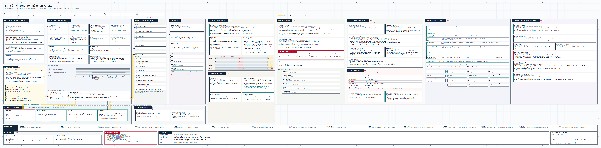

# University Copilot (UC)

> **EN summary:** a personal "copilot" for a HUST student. It reads six official university systems (Outlook mail, Microsoft Teams, eHUST/qldt, iCTSV, the SoICT MOOC and FAMI) in **read-only** mode. It merges everything into one Notion workspace and pushes **time-precise reminders** to the laptop and the phone. AI (Gemini + a local LLM) extracts events from emails and classifies deadlines; n8n orchestrates the Notion side. Built by orchestrating several AIs in phases, each taking over when the previous one hit its limits (Notion AI → ChatGPT → Codex → Freebuff + Codex → Claude Code): I defined the problem, designed the architecture and rules, coordinated the agents, and tested everything on my own semester.

---

## Vấn đề

Là sinh viên Bách khoa, thông tin học tập của tôi nằm rải ở **6 hệ thống khác nhau**:

| Hệ thống | Có gì | Vấn đề |
|---|---|---|
| Outlook (mail trường) | thông báo thi, đổi lịch, sự kiện | thư đính chính chồng lên thư cũ, rất dễ sót |
| Microsoft Teams | bài tập, đổi phòng, tài liệu | phải tự vào từng nhóm lớp để đọc, rồi tải file về tay |
| eHUST (qldt) | thời khoá biểu, điểm | không chủ động nhắc |
| iCTSV | điểm rèn luyện, hoạt động ngoại khoá | tách rời khỏi lịch học |
| MOOC SoICT (daotao.ai) | bài tập có hạn và điểm | không xuất hiện ở đâu khác |
| FAMI số hoá | bài kiểm tra theo chương của các học phần MI | **không được nhắc trên Teams hay bất kỳ đâu** |

App của trường chỉ gửi một thông báo lúc 6h sáng cho cả ngày. Muốn không trễ hạn, tôi phải tự mở cả 6 nơi mỗi ngày.

## Giải pháp

UC chạy trên laptop, cứ 5 phút đọc lại các nguồn (**chỉ đọc**, không bao giờ gửi, xoá hay nộp bài thay tôi). Sau đó nó:

- **Gộp** lịch, hạn, sự kiện vào một workspace Notion và một giao diện web cục bộ.
- **Đọc mail bằng AI**: một sự kiện có nhiều chặng (đăng ký, thi, phúc khảo…). Thư đính chính hiển thị dạng *Trước → Nay*.
- **Nhắc đúng mốc theo mức quan trọng của hạn**, do AI phân loại:
  - *Tự luyện*: 72 / 48 / 36 / 24 giờ trước hạn.
  - *Tự luyện cốt lõi*: thêm 7h, 5h, 3h, 1h, 30', 20', 10'.
  - *Ảnh hưởng điểm môn học*: thêm 10h, 5h, 3h, 1h, 30', 20', 10', 5', 2', 1'.
  - Tiết học: 30 và 15 phút trước, đã tính cả đổi phòng lấy từ Teams.
- **Vẫn nhắc khi laptop gập máy**: các lần nhắc được hẹn sẵn trên máy chủ [ntfy](https://ntfy.sh) tới 70 giờ trước, và tự sửa hoặc huỷ khi lịch thay đổi.
- **Đồng bộ tài liệu hai chiều**: Teams ⇄ thư mục tài liệu trên máy ⇄ Notion. Tài liệu được xếp đúng môn, chống trùng bằng SHA-256.
- **Quét trùng**: phát hiện hạn hoặc lịch bị nhập hai lần. Hai mục khác mã môn thì không bao giờ bị coi là trùng.
- **Có trang riêng trên điện thoại** (Notion) và nhận lệnh xem nhanh qua ntfy.
- **Gom phần hành chính**: thông báo, giấy tờ, thủ tục, đặt vé của CTSV và thư hành chính vào tab *Hành chính*; học bổng có tab riêng. Mỗi mục có link dẫn thẳng tới trang đăng ký, thông báo đã hết hạn tự ẩn.
- **Chi tiết học phần**: bấm một môn để xem lớp thành phần, điểm thành phần và công thức tính điểm (lấy từ Teams, qldt, MOOC, FAMI).
- **Gửi tài liệu sang NotebookLM**: tìm trong kho tài liệu, tích chọn, thêm vào notebook. UC dừng ở đó; việc ôn tập không phải việc của UC.

*Bấm vào ảnh để mở bản SVG nét đầy đủ (rộng 13.800 px, phóng to thoải mái).*

## Các quyết định thiết kế

Đây là phần tôi dành nhiều thời gian nhất:

1. **Luật tối cao: dữ liệu của trường thắng.** Mỗi khi dữ liệu trong Notion khác dữ liệu của trường:
   - *thiếu* → thêm vào;
   - *mâu thuẫn* (ví dụ hạn bị dời) → sửa theo trường, kể cả mục đã qua, và báo "Thay đổi";
   - *thừa* (việc tôi tự đặt) → giữ nguyên.
2. **Chỉ đọc nguồn của trường.** Không đổi trạng thái đã đọc của mail, không gửi hay xoá thư, không bao giờ bấm "Làm bài" trên FAMI hay MOOC.
3. **Không ghi ngầm.** Mọi thao tác ghi từ giao diện (Notion, xoá trùng…) đều phải qua bước xác nhận.
4. **Bài đã hết hạn không biến thành hạn mới.** Chúng được ghi vào lịch sử *Academic Tasks* với kết quả *Đã làm / Bỏ lỡ*, nên không nhắc vô ích.
5. **Điện thoại chỉ để xem và xác nhận đã biết.** Nút "Hoàn tất" và "Tắt nhắc" chỉ có trên máy tính, để không lỡ tay tắt một hạn thật.
6. **Mật khẩu không nằm trong code.** Tài khoản trường cất trong Windows Credential Manager. Tự đăng nhập chỉ điền trên trang đăng nhập Microsoft hoặc trang của trường, tối đa một lần mỗi lượt; gặp xác minh 2 bước hoặc captcha thì dừng và báo người dùng.

## Công nghệ

- **Python** (thư viện chuẩn + Playwright): khoảng 8.500 dòng, chia thành các module theo từng nguồn: `school_mail.py`, `teams_fetch.py`, `mooc.py`, `fami.py`, `mail_events.py`, `deadlines.py`, `alerts.py`, `phone_sched.py`…
- **n8n** (Docker): các luồng tự động phía Notion. Workflow được sinh bằng code (`build.py`), không kéo thả tay. Sơ đồ khối: [Map-n8n.svg](docs/Map-n8n.svg) ([ảnh PNG](docs/Map-n8n.png)).
- **Máy ghi bài giảng** (`lecture-recorder/`, C# .NET 8 + NAudio): ghi giảng đường bằng micro, học online bằng âm thanh máy, hoặc riêng cuộc họp Teams qua cáp ảo VB-CABLE → n8n → chép lời trên máy (PhoWhisper, NPU) → Gemini → ghi chú bài giảng trong Notion.
- **Cổng chép lời** (`speech-gate/`, Python + OpenVINO): kiểm tra chất lượng → chép lời PhoWhisper trên NPU → nén bằng LM Studio; audio không bao giờ gửi cho Gemini.
- **Notion API**: nơi lưu dữ liệu.
- **Gemini API** (flash-lite) để đọc mail và phân loại hạn. **LM Studio** (qwen3-8b, chạy local) để xếp tài liệu.
- **ntfy**: thông báo đẩy và lời nhắc hẹn giờ lên điện thoại.
- Giao diện: một trang HTML/JS do `copilot_app.py` phục vụ tại `127.0.0.1:8320`.

## Cách tôi xây dựng dự án

UC không do một công cụ làm ra. Tôi **điều phối nhiều AI theo từng giai đoạn**. Mỗi khi một công cụ chạm giới hạn (hết quota, quên ngữ cảnh vì dự án quá lớn), tôi chuyển dự án sang công cụ tiếp theo. Bài toán, kiến trúc và luật của cả hệ thống thì tôi giữ xuyên suốt.

Từ lúc nảy ra ý tưởng (18/08/2026) đến bản hiện tại là **khoảng 7 tuần**. (Câu hỏi đầu tiên với Notion AI, "How to use notion ?" ngày 01/03, chỉ là lúc tôi mới cài Notion khi đang ôn thi TSA. Khi đó chưa có dự án hay ý tưởng nào.)

| Giai đoạn | Thời gian | Ai làm | Kết quả |
|---|---|---|---|
| **v0.0.00** | 18/08 – 23/08/2026 | **Notion AI** (chạy Claude Sonnet 5, bản miễn phí) | Ý tưởng nảy ra một tuần trước khi nhập học: "Something important for a Freshman…". Ra bản kiến trúc đầu tiên: Courses là gốc, S1–S8, Academic Work tách Academic Tasks. Tôi cho ChatGPT phản biện qua lại, rồi đánh giá bản chốt vẫn còn quá đơn giản |
| Dựng đầu tiên | 23/08 – cuối 08 | **ChatGPT** + plugin Notion | Lần đầu tôi tập nối plugin. ChatGPT đọc được workspace thật, sửa kiến trúc rồi bắt tay dựng, đến khi hết quota. Hợp với giai đoạn dự án còn nhỏ |
| Sơ đồ khởi nguyên | cuối 08/2026 | **Codex** | Bản thiết kế 10 phần, có Hội đồng 4 AI. Xem [docs/Ban-do-khoi-nguyen-Codex-2026-08.svg](docs/Ban-do-khoi-nguyen-Codex-2026-08.svg) |
| Lõi các agent | 26/08 – giữa 09 | **Codex** | Nhập TKB / deadline, University Inbox (xếp tài liệu), chia nhỏ bài lớn, lập kế hoạch ngày, ghi tiến độ, gợi ý tài liệu, hệ 6-agent đầu tiên. Dự án lớn tới mức Codex quên cả hội thoại sau nhiều lần sửa, quota đốt liên tục |
| Máy ghi bài giảng bản đầu | 09/2026 | **Codex · Freebuff** | Ghi âm và đẩy sang n8n |
| Các phase mở rộng | giữa 09 – 30/09 | **Freebuff + Codex** | Quick Upload, Health Ping, Reconciliation, Council Bridge (nối Hội đồng AI), Conductor |
| Agent theo lịch | 09/2026 | **ChatGPT** (scheduled task) | Chuyển kỳ, tìm tài liệu. Sau đó chuyển hết vào n8n |
| Tiếp quản, hợp nhất và mở rộng | từ đầu 10 | **Claude Code** | Gộp thành một workflow; đồng bộ 6 hệ thống của trường; luật tối cao; nhắc theo mốc lên điện thoại; ghi bài giảng v2 (cáp Teams, chép lời trên NPU); tab Hành chính, Học bổng, Ngoại khoá; giám sát; chat có công cụ và trí nhớ |

Phần việc của tôi xuyên suốt mọi giai đoạn:

- đặt bài toán từ chính khó khăn của mình;
- chọn công cụ, chia việc cho từng AI, đối chiếu và gộp kết quả của chúng;
- quyết định luật và kiến trúc: luật tối cao, ba mức hạn, chỉ đọc nguồn trường, điện thoại không có nút tắt, không ghi ngầm;
- phát hiện lỗi khi dùng thật và yêu cầu sửa, ví dụ:
  - AI lấy nhầm giờ nhận thư làm giờ sự kiện;
  - hai bài "vá hổng chương I" của hai môn khác nhau bị coi là trùng;
  - bài ngầm trên FAMI bị bỏ sót;
  - chat báo "đã dời hạn" trong khi không làm gì.

Từng thay đổi được kiểm thử trên học kỳ thật của tôi.

## Đóng góp

| | Vai trò |
|---|---|
| **[@RichardHenry939](https://github.com/RichardHenry939)** | Chủ dự án: bài toán, kiến trúc, luật, điều phối các AI, kiểm thử |
| **Notion AI** (Claude Sonnet 5) | v0.0.00: bản kiến trúc dữ liệu đầu tiên |
| **ChatGPT** (OpenAI) | Phản biện kiến trúc, dựng bản đầu qua plugin Notion; sau đó chạy agent theo lịch (chuyển kỳ, nghiên cứu tài liệu) |
| **Codex** (OpenAI) | Sơ đồ khởi nguyên, lõi các agent, máy ghi bài giảng bản đầu |
| **Freebuff** | Các phase mở rộng B–J, máy ghi bài giảng bản đầu |
| **Claude Code** (Anthropic) | Tiếp quản từ đầu 10: hợp nhất hệ thống, đồng bộ trường, các tab và công cụ |

**Chạy bên trong hệ thống:**
- **Gemini** (Google): đọc thư, phân loại, phân tích bài giảng đã nén;
- **Qwen3** qua **LM Studio**: nén bản chép lời, dự phòng khi hết quota, chạy local;
- **PhoWhisper** (VinAI): chép lời tiếng Việt trên NPU;
- **Hội đồng 4 AI** trong AgentChattr: Claude, Codex, Gemini và một AI local, dùng để hỏi ý kiến khi gặp vấn đề khó.

## Nhật ký bản vá

Mỗi lần cập nhật mã nguồn được tính là một bản vá (các lần chỉ sửa README hay bản đồ không tính). Mỗi bản có tag git tương ứng.

| Bản | Ngày | Nội dung |
|---|---|---|
| **v1.00.00** | 04/10/2026 | Bản công khai đầu tiên: đồng bộ 6 hệ thống của trường, luật tối cao, nhắc theo mốc lên điện thoại, đồng bộ tài liệu, quét trùng, bản đồ hệ thống |
| **v1.00.01** | 05/10/2026 | Chat trung thực: chỉ báo "đã làm" khi công cụ trả kết quả thật. Công cụ dời hạn tự đặt (xem trước rồi mới ghi, không đụng hạn của trường). Ghi bài giảng riêng cuộc họp Teams qua cáp ảo |
| **v1.00.02** | 05/10/2026 | Thêm mã nguồn máy ghi bài giảng (`lecture-recorder/`) |
| **v1.00.03** | 05/10/2026 | Phân loại thư (môn học, ngoại khoá, hành chính, học bổng, thông báo chung). Tab Hành chính và Học bổng. Đọc đủ 1000 sự kiện CTSV. Giám sát Ghi bài giảng ngay trong UC. Chat nhớ hội thoại. Mọi nguồn cập nhật 5 phút một lần |
| **v1.00.04** | 05/10/2026 | Thêm cổng chép lời (`speech-gate/`), kèm vá: tự thử lại khi LM Studio lỗi, model dự phòng, chạy tiếp từ bước nén |
| **v1.00.05** | 06/10/2026 | Tự ẩn thông báo hết hạn hoặc của năm cũ. Chi tiết điểm học phần. Gửi tài liệu sang NotebookLM. Script giữ phiên NotebookLM. Đọc cả kênh ẩn và Shared Documents trên Teams. Lượt đồng bộ lỗi không còn ghi đè dữ liệu tốt |
| **v1.00.06** | 06/10/2026 | Cách tính điểm cho mọi môn, tự động mọi kỳ: đọc thêm trả lời trong luồng ở mọi kênh, Class Notebook và nội dung mọi slide / đề cương (trước chỉ đọc file có tên "đánh giá", nên sót IT1108 có công thức nằm trong slide chương 1). Ưu tiên bài nói rõ nhất về cách tính, bỏ qua trả lời của sinh viên |
| **v1.00.07** | 06/10/2026 | Sửa lỗi điểm cuối kỳ "ma": thành phần "Cuối kỳ trên MOOC tại phòng máy" (IT2000) bị gán nhầm điểm bài tập MOOC hằng tuần. Cuối kỳ giờ được nhận diện trước, và chỉ lấy điểm khi qldt có nhãn CK rõ ràng |

## Chạy thử

> Đây là công cụ cá nhân, gắn với tài khoản sinh viên HUST và workspace Notion của tôi. Repo này để tham khảo cách làm, chưa phải sản phẩm cài một lần là chạy.

1. Cài Python 3.12+ và `pip install playwright keyring`, rồi `playwright install chrome`.
2. Sao chép `config.example.json` thành `config.json`, điền ID database Notion, ID credential n8n và các đường dẫn.
3. Đặt biến môi trường `GEMINI_API_KEY` và `N8N_API_KEY`. Tạo file `.copilot-secret` chứa một chuỗi ngẫu nhiên, dùng để ký các liên kết nội bộ.
4. Cất tài khoản trường: `python school_cred.py`. Mật khẩu gõ vào ô ẩn và được lưu trong Windows Credential Manager.
5. Sinh workflow n8n: `python build.py`. Mở giao diện: `open_copilot.ps1`.

## Quyền riêng tư

Repo **không** chứa dữ liệu cá nhân nào: mail, điểm, lịch, ID Notion, kênh ntfy, khoá API hay mật khẩu đều không có. Mọi giá trị riêng nằm trong `config.json`, biến môi trường hoặc Credential Manager, và đều đã nằm trong `.gitignore`.

Đây là công cụ cá nhân, **không liên kết hay được bảo trợ bởi Đại học Bách khoa Hà Nội**. Công cụ chỉ đọc dữ liệu mà chính tài khoản sinh viên của người dùng được phép xem.
